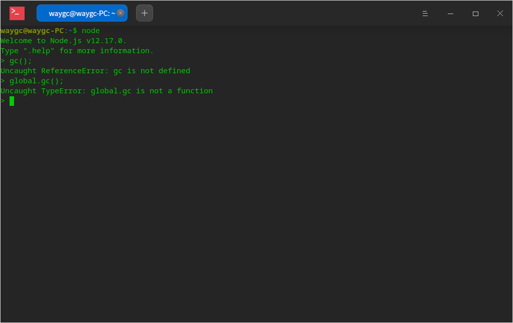

[目录](./)
# global.gc的问题

之前从网络上看资料说 `global.gc()` 可以调用垃圾清理。

但实际调用 `global.gc()` 的时候会有下面的错误提示：  

事实上用不了这个函数，原因未知。

还有一个问题，在官方 API （[http://nodejs.cn/api/globals.html#globals_global_objects](http://nodejs.cn/api/globals.html#globals_global_objects)）中，没有 `global.gc()` 这个函数。

但至少 soc 上面却有一堆关于 `global.gc()` 的问题：[https://stackoverflow.com/search?q=global.gc](https://stackoverflow.com/search?q=global.gc)  
有些糊涂。