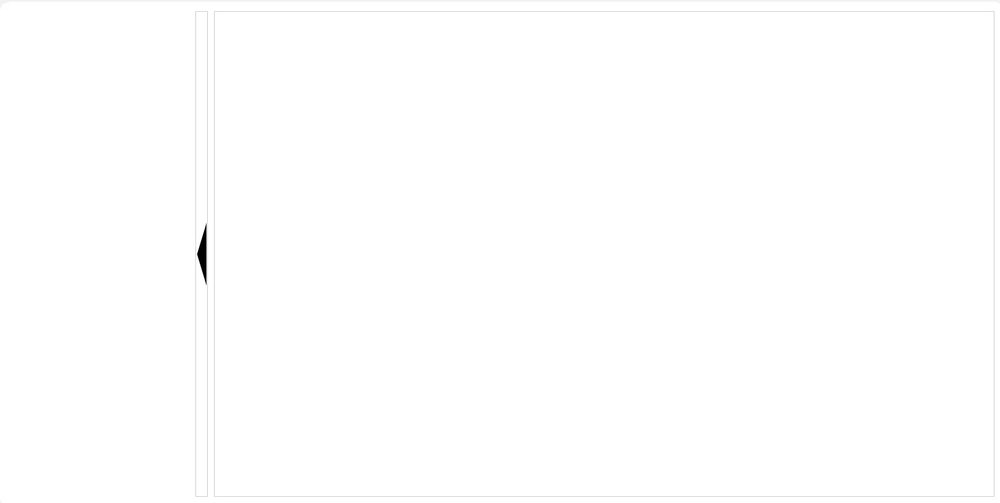

[目录](./)

# 开合收放

不知道怎么命名，竖着的手风琴？  
反正就是类似各种管理后台左侧目录收放的那种操作。



```
<template>
  <div class="decice-detail-box" :style="`height: ${height}px;`">
    <div>
      <div :class="isStart ? (leftClose ? 'left-side-close' : 'left-side-open') : 'left-init'">
        <div class="left-box-btn" @click="onClickBtn"></div>
      </div>
    </div>
    <div :class="isStart ? (leftClose ? 'right-size-stretch' : 'right-side-shrink') : 'right-init'"></div>
  </div>
</template>
<script>
export default {
    props: {
        height: {
            type: Number,
            default: 0
        }
    },
    data () {
      return {
        isStart: false,
        leftClose: false
      }
    },
    created () {
      console.log(this.isStart);
    },
    methods: {
      onClickBtn () {
        this.isStart = true;
        this.leftClose = !this.leftClose;
      }
    }
}
</script>
<style lang="scss" scoped>
.decice-detail-box {
    >div {
        display: inline-block;
        vertical-align: top;
        height: 100%;
        &:first-child {
          padding-right: 10px;
          height: 100%;
          >div {
            height: 100%;
            display: inline-block;
            position: relative;
            vertical-align: top;
            background-position: center right;
            background-repeat: no-repeat;
            .left-box-btn {
              position: absolute;
              right: 0px;
              width: 20px;
              height: 100%;
              cursor: pointer;
              border:1px solid #CCCCCC;
            }
          }
        }
        &:last-child {
            border:1px solid #CCCCCC;
        }
    }
}

.left-init {
  width: 320px;
  overflow: hidden;
  background-image: url(./../../../../../assets/images/left-arrow.svg);
}
.right-init {
  width: calc(100% - 330px);
}

.left-side-close {
  animation:left_close 1s;
	animation-play-state:running;
	-webkit-animation:left_close 1s;
	-webkit-animation-play-state:running;
  animation-fill-mode: forwards;
}
@keyframes left_close
{
	0%   {
    background-image: url(./../../../../../assets/images/left-arrow.svg);
    width: 320px;
  }
	99% {
    background-image: url(./../../../../../assets/images/left-arrow.svg);
    width: 20px;
  }
	100% {
    background-image: url(./../../../../../assets/images/right-arrow.svg);
    width: 20px;
  }
}

.left-side-open {
  animation:left_open 1s;
	animation-play-state:running;
	-webkit-animation:left_open 1s;
	-webkit-animation-play-state:running;
  animation-fill-mode: forwards;
}
@keyframes left_open
{
	0%    {
    background-image: url(./../../../../../assets/images/right-arrow.svg);
    width: 20px;
  }
	99%  {
    background-image: url(./../../../../../assets/images/right-arrow.svg);
    width: 320px;
  }
	100%  {
    background-image: url(./../../../../../assets/images/left-arrow.svg);
    width: 320px;
  }
}

.right-side-shrink {
  animation:right_shrink 1s;
	animation-play-state:running;
	-webkit-animation:right_shrink 1s;
	-webkit-animation-play-state:running;
  animation-fill-mode: forwards;
}
@keyframes right_shrink
{
	0%   { width: calc(100% - 30px);  }
	99% { width: calc(100% - 330px); }
	100% { width: calc(100% - 330px); }
}

.right-size-stretch {
  animation:right_stretch 1s;
	animation-play-state:running;
	-webkit-animation:right_stretch 1s;
	-webkit-animation-play-state:running;
  animation-fill-mode: forwards;
}

@keyframes right_stretch
{
	0%   { width: calc(100% - 330px); }
	99% { width: calc(100% - 30px);  }
	100% { width: calc(100% - 30px);  }
}

</style>
```